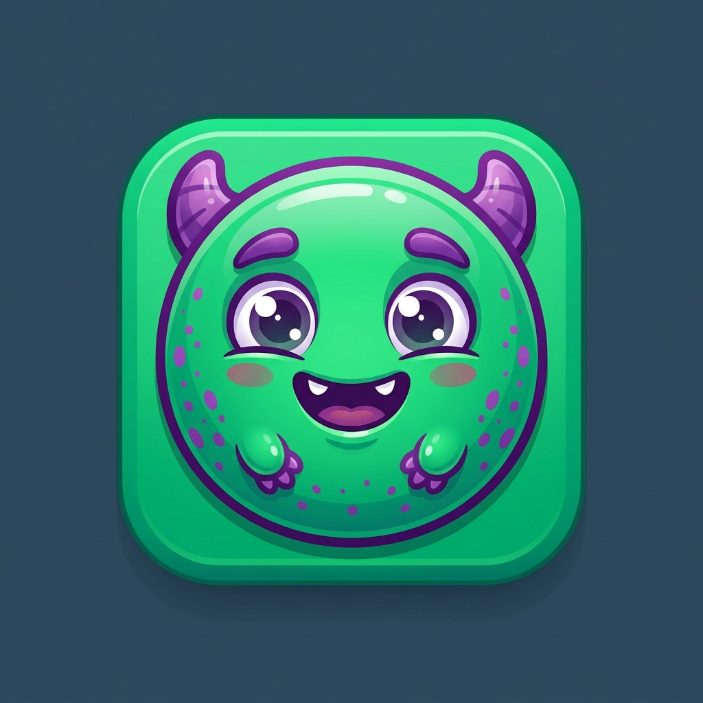

# 🐉 Monster Merge

A vibrant and addictive 2048-style evolution game. Merge cute monsters to discover powerful new species and eventually reach the legendary **Elder-Drake**.



## 🚀 Features

- **Addictive Gameplay**: Classic 2048 mechanics with a monster evolution twist.
- **Beautiful Discovery**: Unlock unique monster tiers, each with its own personality and design.
- **Cross-Platform**: Built as a high-performance web app and wrapped for Android via Capacitor.
- **Premium Aesthetics**: Dark mode, glassmorphism, and smooth Framer Motion animations.

## 🛠 Tech Stack

- **Core**: React 19 + TypeScript
- **Bundler**: Vite
- **Styling**: Tailwind CSS
- **State Management**: Zustand
- **Animations**: Framer Motion
- **Native Runtime**: Capacitor 6+ (Android)

## 📦 Getting Started

### Prerequisites

- Node.js (via `nvm` recommended)
- npm or yarn
- Android Studio (for mobile builds)

### Web Development

1. Install dependencies:
   ```bash
   npm install
   ```
2. Start the development server:
   ```bash
   npm run dev
   ```

### Android Build & Deployment

The project is already initialized with Capacitor. To build a new Android version:

1. Build the web project:
   ```bash
   npm run build
   ```
2. Sync the web assets to the Android project:
   ```bash
   npx cap sync
   ```
3. Open in Android Studio:
   ```bash
   npx cap open android
   ```
   *From Android Studio, you can run the app on a physical device or emulator.*

### Production Release

To generate a production-signed Android App Bundle (.aab):

```bash
cd android && ./gradlew bundleRelease
```

## 📜 Development Notes

- **App ID**: `com.monster2048.game`
- **Asset Generation**: We use `@capacitor/assets` to generate icons and splash screens from source images in the `assets/` folder.

## 🎮 How to Play

1. **Swipe** up, down, left, or right to move all monsters.
2. When two monsters of the same tier touch, they **merge** into a higher-tier evolution.
3. Discover all tiers to win!

---

Built with ❤️ for the Android Play Store.
